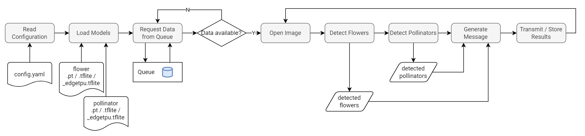

# Pollinator Detection with YOLOv5

**Image &rarr; Flowers &rarr; Pollinators**

## Installation

Clone the repository
```sh
git clone https://github.com/WullT/Pollinatordetection.git
```

Install requirements
```sh
cd Pollinatordetection
pip3 install -r requirements.txt
```

Create a copy of the sample configuration file
```sh
cp sample_configuration.yaml config.yaml
nano config.yaml
```

## Model Configuration

A flowchart of the application is shown below:



Edit the configuration of the models in the section `models`:

```yaml
models:
  flower:
    weights_path: models/flower_n.pt
    class_names: ["daisy", "wildemoere","flockenblume"]
    confidence_threshold:  0.25
    iou_threshold: 0.5
    max_detections: 30
    margin: 10
    multi_label: false
    multi_label_iou_threshold: 0.7
    augment: false
    image_size: 640
  pollinator:
    weights_path: models/pollinator_m.pt
    class_names: ["honigbiene", "wildbiene","hummel","schwebfliege","fliege"]
    confidence_threshold:  0.25
    iou_threshold: 0.45
    max_detections: 10
    margin: 40
    multi_label: true
    multi_label_iou_threshold: 0.3
    augment: false
    image_size: 640
```
| Option                      | Description                                                                        |
| --------------------------- | ---------------------------------------------------------------------------------- |
| `weights_path`              | path to the model weights file                                                     |
| `local_yolov5_path`         | path to a local yolov5 repo (optional)                                             |
| `class_names`               | an array of class names (class_id[0] = class_names[0])                             |
| `confidence_threshold`      | nms confidence threshold                                                           |
| `iou_threshold`             | nms iou threshold                                                                  |
| `max_detections`            | max objects to detect in an image                                                  |
| `margin`                    | add a margin to the objects for cropping (in pixel)                                |
| `multi_label`               | enable multiple predictions for the same objects                                   |
| `multi_label_iou_threshold` | iou threshold to decide wether two detected objects are the same object            |
| `augment`                   | inference-time augmentation (see https://github.com/ultralytics/yolov5/issues/303) |
| `image_size`                | the image size that is expected by the model                                       |

### Supported formats

* PyTorch (`.pt`)
* TFLite (`.tflite`)
* EdgeTPU (`_edgetpu.tflite`) (depending on plattform)


## Input Configuration

The application expects image files as input. There is an option to delete the files after processing:
```yaml
input:
  remove_after_processing: false
```

There are two ways to get the filenames:

### Message Queue Input

Filenames can be requested from a running [ZMQMessageQueue](https://github.com/WullT/ZMQMessageQueue) instance:

```yaml
input:
  type: message_queue # or directory
  message_queue:
    zmq_host: localhost
    zmq_port: 5557
    request_timeout: 3000
    request_retries: 10
```

### Directory Input

Filenames can be found by scanning the filesystem for new files:

```yaml
input:
  type: directory
  directory:
    base_dir: input
    extension: .jpg
```

## Output Configuration

The output is in JSON Format, crops are base64 encoded.

if `output.ignore_empty_results` is set to true, results without detections will be ignored.

```yaml
output:
  ignore_empty_results: false
```

### Store results as file

Store the result files locally.
This will generate a directory structure as follows:
```
<base_dir>/<node_id>/<date>/<hour>/<filename>.json
```
```yaml
output:
  file:
    store_file: true
    base_dir: output
    save_crops: true
```
If no crops are needed, the option `save_crops` can be set to false.

### HTTP
Transmit results to a HTTP endpoint.

```yaml
output:
  http:
    transmit_http: true
    url: http://localhost:8080/api/v1/pollinators?node_id=${node_id}
    method: POST
    username: admin
    password: admin
```


### MQTT
Publish results to an MQTT broker.
```yaml
output:
  mqtt:
    transmit_mqtt: true
    host: mqtt.example.com
    port: 8883
    username: mqtt_user
    password: mqtt_password
    topic: "results/${hostname}/json"
    use_tls: true
```

### Placeholders

In `output.http.url` and `output.mqtt.topic`, following placeholders are available

| Placeholder   | will be replaced with                                 |
| ------------- | ----------------------------------------------------- |
| `${filename}` | the generated filename `<node_id>_<time_string>.json` |
| `${node_id}`  | the id of the node which captured the image           |
| `${hostname}` | the hostname                                          |

## Output Format

The results are stored or transmitted in JSON format.
A sample output message is shown below.

```json
{
    "detections": {
        "flowers": [
            {
                "index": 0,
                "class_name": "daisy",
                "score": 0.948,
                "size": [
                    312,
                    291
                ]
            },
            {
                "index": 1,
                "class_name": "daisy",
                "score": 0.936,
                "size": [
                    424,
                    438
                ]
            },
            {
                "index": 2,
                "class_name": "flockenblume",
                "score": 0.914,
                "size": [
                    213,
                    237
                ]
            }
        ],
        "pollinators": [
            {
                "index": 0,
                "flower_index": 1,
                "class_name": "schwebfliege",
                "score": 0.873,
                "crop": "/9j/4A ... 2Q=="
            },
            {
                "index": 1,
                "flower_index": 2,
                "class_name": "schwebfliege",
                "score": 0.901,
                "crop": "/9j/4AAQ ... 2Q=="
            }
        ]
    },
    "metadata": {
        "node_id": "0344-6782",
        "capture_timestamp": "2021-07-22 11:02:25",
        "flower_inference": {
            "confidence_threshold": 0.45,
            "iou_threshold": 0.45,
            "margin": 15,
            "multi_label": false,
            "multi_label_iou_threshold": 0.7,
            "model_name": "flowers_640_n.pt",
            "max_det": 30,
            "augment": false,
            "inference_times": [
                0.22
            ]
        },
        "pollinator_inference": {
            "confidence_threshold": 0.6,
            "iou_threshold": 0.45,
            "margin": 60,
            "multi_label": true,
            "multi_label_iou_threshold": 0.45,
            "model_name": "pollinators_480_s.pt",
            "max_det": 10,
            "augment": false,
            "inference_times": [
                0.205,
                0.029
            ]
        },
        "original_image": {
            "size": [
                3280,
                2464
            ]
        }
    }
}
```